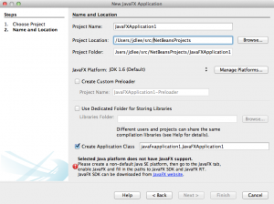
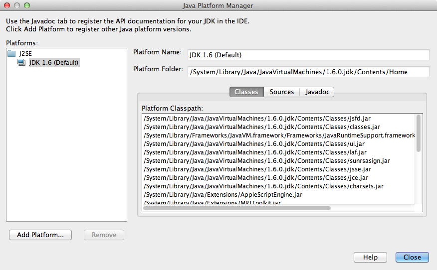
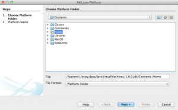
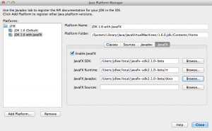
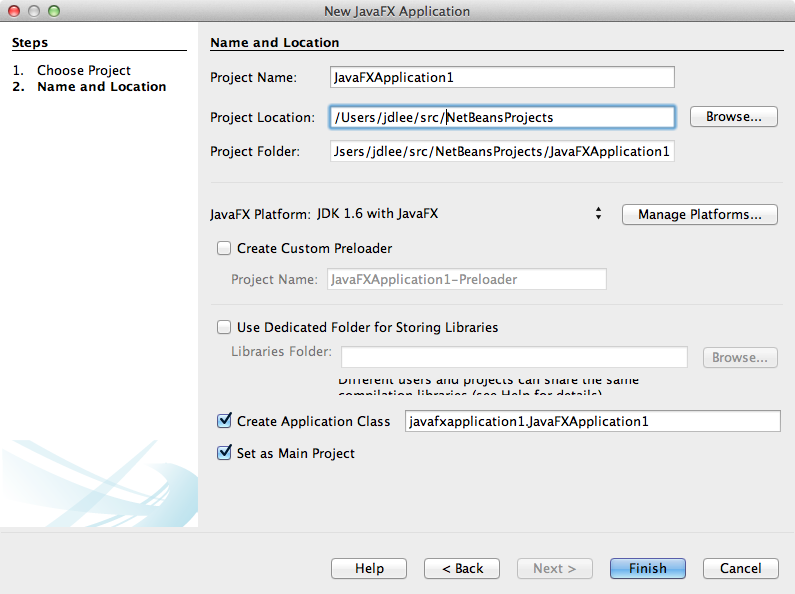

= Getting Started with JavaFX on the Mac
Jason Lee
2012-04-05

image::javafx_logo_color_1-300x150.jpg

As you may have guessed from my recent link:/2012/04/book-review-pro-javafx-2-a-definitive-guide-to-rich-clients-with-java-technology/[book review], I've been tinkering with JavaFX some, as time as permitted.  I've been following the technology fairly closely since Sun announced the project way back in 2008.  When it was announced that JavaFX 2.0 was _finally_ available, albeit in preview form, for the Mac, I was ecstatic.  I ran into issues, though, trying to get it to run in my http://netbeans.org[IDE], though.  After some guess work and googling, I finally figured it out.  In retrospect, it may be obvious, but if you're like me and are missing the obvious, I'm going to detail the steps I took to get it running on my Mac.  Perhaps it can help someone out.more

The first step, of course, is to download the binaries.  You can do that http://www.oracle.com/technetwork/java/javafx/downloads/index.html[here], sort of.  Since this is still a preview release at the time of this writing, you have click the teeny tiny http://www.oracle.com/technetwork/java/javafx/downloads/devpreview-1429449.html[link] under the header.  Once you've downloaded the distribution, you need to extract it somewhere:

[source,bash,linenums]
----
$ unzip javafx_sdk-2_1_0-beta-b19-macosx-universal-27_mar_2012.zip -d $HOME/local/
----
You can, of course, put it anywhere you want, but you'll need to adjust the following instructions.  The next step is set up NetBeans.  NetBeans has JavaFX support out of the box, assuming your JDK has JavaFX support.  Since the Mac JDK does not yet, we need fix that.  Otherwise, you'll see this error:

To fix this, we need to create a Java Platform with JavaFX support (I don't know why we can't modify the default platform, but we can't, so we get to create a new one, which we can set to be the default if we want).  To do that, go to Tools > Java Platforms, where you should see something like this:

To create a new Java Platform, click the (wait for it...!) "Add Platform..." button in the lower left corner.  OS X likes to put things in decidedly (to me) un-Unixy locations, and the JDK is no different. You can find the current JDK under `/System/Library/Java/JavaVirtualMachines/1.6.0.jdk/Contents`:

We now need to give it a name, so we'll call this "JDK 1.6 with JavaFX" and click OK.  But wait, there's no JavaFX support! To enable JavaFX support, we have to...um..enable it.  Doing so looks like this:

We can now create a new JavaFX project:

Your new project is ready to run.

The even more adventurous may be wondering how one would do this with Java 7, to which I say, "Good question!" : )  I have mixed luck getting NetBeans and Java 7 to play nice on my Mac.  It's almost certainly pilot error, as I've done it before, as has http://www.adam-bien.com/roller/abien/entry/how_to_run_netbeans_7[Adam Bien], but I haven't had a chance to debug things (e.g., the navigation tree under projects has all the tree icons, but no text.  IIRC, the context menus are also text-less. Strange).

At any rate, as I noted earlier, in retrospect, this seems pretty easy (if a bit unintuitive) and might be documented somewhere, but I couldn't find it.  Either way, it's certainly documented now.  I hope it helps. : )
