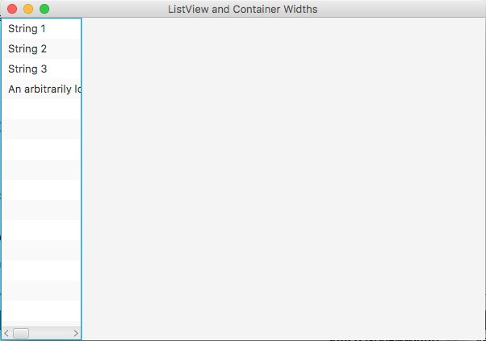
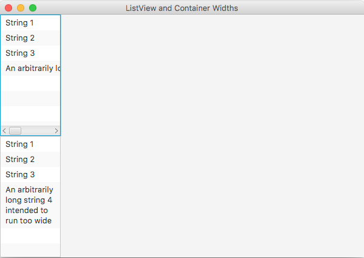

I recently struggled trying to text in a JavaFX ListView to wrap inside the container like
I asked it to, rather than extend (and disappear) past the boundaries of the container. After
some discussion on Twitter and a bit of Googling, I found an answer that I thought I'd share
here to, perhaps, save someone some time.

// more

Let's start by looking at what I'm trying to solve using this contrived example:

Notice that the fourth entry is cut off and that the ListView has a scrollbar at the bottom. That's
precisely what I don't want. Before we see the fix, let's look at the offending code first.

[source,java]
----
public class ListWidthController implements Initializable {
    @FXML
    private ListView listView1;

    @Override
    public void initialize(URL url, ResourceBundle rb) {
        List<String> strings = Arrays.asList(
                "String 1",
                "String 2",
                "String 3",
                "An arbitrarily long string 4 intended to run too wide"
        );

        listView1.setItems(FXCollections.observableArrayList(strings));
}
----

[source,xml]
----
<BorderPane prefHeight="400.0" prefWidth="600.0"
        xmlns="http://javafx.com/javafx/8.0.111"
        xmlns:fx="http://javafx.com/fxml/1"
        fx:controller="com.steeplesoft.listviewwidth.ListWidthController">
   <left>
      <VBox prefHeight="200.0" prefWidth="100.0" BorderPane.alignment="CENTER">
         <children>
            <ListView fx:id="listView1" prefHeight="200.0" prefWidth="200.0" VBox.vgrow="ALWAYS" />
         </children>
      </VBox>
   </left>
</BorderPane>
----

This is, of course, an overly simplified example. In most real world cases, I would expect
that the ListView would have a custom ListCell, which we'll need to make this display correctly. We'll
start by adding another ListView to the UI so we can see them at the same time:

[source,xml]
----
<BorderPane prefHeight="400.0" prefWidth="600.0"
        xmlns="http://javafx.com/javafx/8.0.111"
        xmlns:fx="http://javafx.com/fxml/1"
        fx:controller="com.steeplesoft.listviewwidth.ListWidthController">
   <left>
      <VBox prefHeight="200.0" prefWidth="100.0" BorderPane.alignment="CENTER">
         <children>
            <ListView fx:id="listView1" prefHeight="200.0" prefWidth="200.0" VBox.vgrow="ALWAYS" />
            <ListView fx:id="listView2" prefHeight="200.0" prefWidth="200.0" VBox.vgrow="ALWAYS" />
         </children>
      </VBox>
   </left>
</BorderPane>
----

In our controller, we inject the new control:

[source,java]
----
@FXML
private ListView listView2;
----

and configure it:

[source,java]
----
listView2.setItems(FXCollections.observableArrayList(strings));
----

Notice that we're using the same source data for grins. If you were to runt his now,
though, you'd get the same result, so let's add our custom ListCell and get things looking
like we want them:

[source,java]
----
listView2.setCellFactory(new Callback<ListView<String>, ListCell<String>>() {
    @Override
    public ListCell<String> call(ListView<String> param) {
        return new ListCell<String>() {
            {
                prefWidthProperty().bind(listView2.widthProperty().subtract(20)); // 1
                setMaxWidth(Control.USE_PREF_SIZE); //2
            }

            @Override
            protected void updateItem(String item, boolean empty) {
                if (item != null && !empty) {
                    this.setWrapText(true); // 3
                    setText(item);
                } else {
                    setText(null);
                }
            }

        };
    }
});
----

On our second ListView, we pass in a cell factory, which we create using an anonymous
inner class, as is the custom in a lot of JavaFX code. The factory returns the custom
ListCell, also an anonymous class, where the real work happens.

1. We bind the preferred width of the cell to the width property of the enclosing list.
If we bound width to width, the cell would grow to fill the ListView, which would then
grow a bit to give room for the cell, which then grow, etc, etc, resulting in a mildly
amusing, if wildly incorrect animation in the running application. We end up subtracting
a few pixels to give room for control borders, etc. I'm not 100% sure on that, but the
sources I found suggested doing that, and leaving it out resulted in a scrollbar still
displaying.
2. We set the max width to the computed size which, if I my SWAG is correct, prevents the
control from being resized? I could use some clarification on that point. :)
3. We tell the cell to wrap text (if needed). Otherwise, the text would just get cut
off at the control border, which is certainly not what we want.

Build and run now and you get something like this:

B-e-a-utiful.
