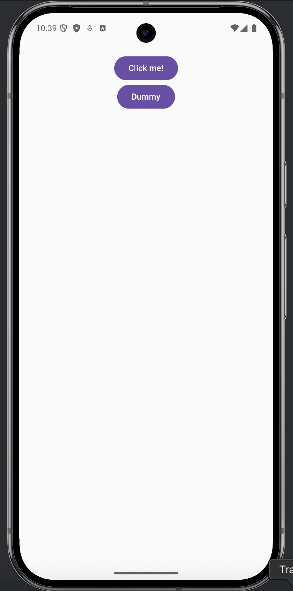
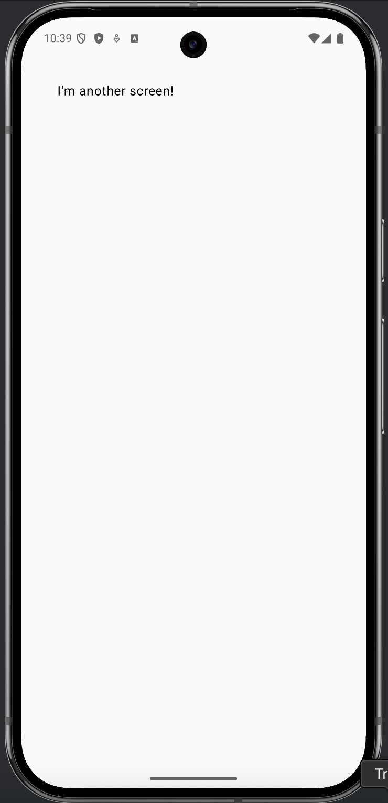

In the link:/2025/decompose-navigation-and-the-root-component[last post], we added the various pieces to make navigation possible and stopped JUST short of the goal line. In this post, we'll finish up our navigation discussion by adding a new screen and seeing navigation in action.

== The Needed Pieces [[pieces]]

Each screen/page in our app will need several changes:

. A component class
. A content function
. A NavigationConfig entry
. Child factory support in `RootComponent.child`
. Child content support in `RootContent()`

== The Component

For demo purposes, we're just going to add a very simple screen (that we fully intend to throw away later). We could create a screen our app will actually use later, but I don't want to muddy the details here by introducing our app's business logic. That said, here's our dummy component:

[source,kotlin]
-----
import com.arkivanov.decompose.ComponentContext

class DummyComponent(componentContext: ComponentContext) :
        ComponentContext by componentContext {

    fun saySomething() : String {
        return "I'm another screen!"
    }
}
-----

== The Content [[content]]

The content is, of course, a `@Composable` function. Technically, it can reside anywhere you want, but I tend to like Decompose's example, so we'll put this in `DummyContent.kt`:

[source,kotlin]
-----
import androidx.compose.foundation.layout.Column
import androidx.compose.foundation.layout.fillMaxSize
import androidx.compose.material3.Text
import androidx.compose.runtime.Composable
import androidx.compose.ui.Modifier

@Composable
fun dummy(
    component: DummyComponent,
    modifier: Modifier = Modifier
) {
    Column(
        modifier = modifier
            .safeContentPadding()
            .fillMaxSize()
    ) {
        Text(text = component.saySomething())
    }
}
-----

== NavigationConfig [[navconfig]]

Our new screen doesn't need any data, so we can simply add a `data object`:

[source,kotlin]
-----
import kotlinx.serialization.Serializable

@Serializable
sealed interface NavigationConfig {
    @Serializable
    data object Home : NavigationConfig

    @Serializable
    data object Dummy : NavigationConfig
}
-----

== Child Factory support [[childfactory]]

Now we need to update the child factory function to take in the `NavigationConfig` and return the associated component:

[source,kotlin]
-----
private fun child(config: NavigationConfig,
                  componentContext: ComponentContext): ComponentContext {
    return when (config) {
        is NavigationConfig.Home -> GreeterComponent(componentContext)
        is NavigationConfig.Dummy -> DummyComponent(componentContext)
    }
}
-----

== Child content support [[childcontent]]

And, finally, we need to tell Compose what to render:

[source,kotlin]
-----
Children(
    stack = component.stack,
    modifier = modifier.padding(5.dp),
    animation = stackAnimation(slide()),
) {
    val childModifier = modifier.fillMaxWidth().padding(10.dp)
    when (val component = it.instance) {
        is GreeterComponent -> greeter(component, childModifier)
        is DummyComponent -> dummy(component, childModifier)
    }
}
-----

== 2, 4, 6, 8! It's time for us to navigate!

We have all the pieces in place, so now we just need to add a way for the user to cause the app to navigate. To do that, we're going to add a button to our "home" screen. Let's start with the content:

[source,kotlin]
-----
@Composable
fun greeter(
    component: GreeterComponent,
    modifier: Modifier = Modifier
) {
    var showContent by remember { mutableStateOf(false) }
    Column(
        modifier = Modifier
            .safeContentPadding()
            .fillMaxSize(),
        horizontalAlignment = Alignment.CenterHorizontally,
    ) {
        Button(onClick = { showContent = !showContent }) {
            Text("Click me!")
        }
        AnimatedVisibility(showContent) {
            val greeting = remember { component.greet() } // !!!
            Column(Modifier.fillMaxWidth(), horizontalAlignment = Alignment.CenterHorizontally) {
                Image(painterResource(Res.drawable.compose_multiplatform), null)
                Text("Compose: $greeting")
            }
        }

        Button(onClick = { component.dummy() }) {
            Text("Dummy")
        }
    }
}
-----

Note the `Button` we added to the bottom of the content. That button will call a function we'll now add to `GreeterComponent`:

[source,kotlin]
-----
fun dummy() {
    nav.pushToFront(NavigationConfig.Dummy)
}
-----

And now we run the app. You should see a gem like this:

And if you click on `Dummy`, you'll be presented with this gem:

It's super ugly, but it works, and that's the important part. In the next entry in the series, we'll start working on our business logic and introducing some data-driven screens.
