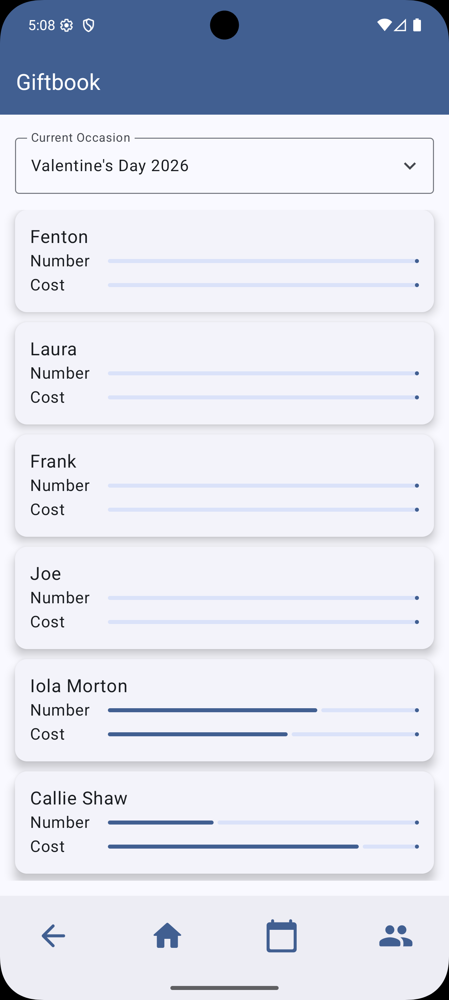

:toc:

In the last post -- months ago (and, yes, I hand typed the em dash, not some soulless AI :) -- we added support for the Room database API, so now we can store data, but we have no way of seeing what we've saved. We also have no way of giving it data _to_ save. In this post, we'll tackle the first part by loading the database with demo data, then creating views to show what we have. Let's dive in.

== A Real Custom Screen [[CustomView]]

Currently, our application has just the demo screen from the generator plus our dummy screen use to demonstrate navigation. Our first step will be to fix that. Let's start by moving `RootComponent` and `RootContent` to the package `com.steeplesoft.giftbook.ui.root`, and deleting `DummyComponent`, `DummyContent`, `GreeterComponent`, and `GreeterContent`.  This breaks our app, of course, but we'll clean that up as we go.

Next, let's create a new component in the package `com.steeplesoft.giftbook.ui.home`. You are free to organize your classes how you'd like, so if you feel this is overkill, feel free to adjust as needed.

.HomeComponent.kt
[source,java]
----
import com.arkivanov.decompose.ComponentContext

class HomeComponent(
    componentContext: ComponentContext,
    var occasionId: Long? = null
) : ComponentContext by componentContext {

}
----

.HomeContent.kt
[source,java]
----
import androidx.compose.material3.Text
import androidx.compose.runtime.Composable
import androidx.compose.ui.Modifier

@Composable
fun Home(
    component: HomeComponent,
    modifier: Modifier = Modifier
) {
    Text(text = "Hello")
}
----

And now let's fix build:

.RootComponent
[source,java]
----
// ...
private fun child(config: NavigationConfig,
                  componentContext: ComponentContext): ComponentContext {
    return when (config) {
        is NavigationConfig.Home -> HomeComponent(componentContext)
    }
}
----

.RootContent
[source,java]
----
// ...
when (val component = it.instance) {
    is HomeComponent -> Home(component, childModifier)
}
----

and, finally

.NavigationConfig
[source,java]
----
@Serializable
sealed interface NavigationConfig {
    @Serializable
    data object Home : NavigationConfig
}
----

It's not pretty, but it's an honest start. :) What we want this screen to something like this:

We'll not get there completely in this post, but this shows you where we're heading. Let's start with page decorations.

== `Scaffold`: Prettier Page Decorations

In the screenshot above, the page has a header and a footer. Those are added in `RootContent`, as this allows all of our screens to have the same decorations. We'll do that be replacing this:

[source,java]
----
    Column(modifier = modifier) {
        Children(
            stack = component.stack,
            modifier = modifier.padding(5.dp),
            animation = stackAnimation(slide()),
        ) {
----

with this:

[source,java]
----
Scaffold(
    modifier = Modifier.fillMaxSize(),
    topBar = {
        TopAppBar(
            colors = TopAppBarDefaults.centerAlignedTopAppBarColors(
                containerColor = MaterialTheme.colorScheme.primary,
            ),
            title = {
                Text(
                    text = stringResource(Res.string.app_name),
                    color = MaterialTheme.colorScheme.onPrimary
                )
            }
        )
    }
) { innerPadding ->
    Children(
        // ...
----

I won't pretend I understand everything about the `Scaffold`, so I'll quote the link:https://developer.android.com/develop/ui/compose/components/scaffold[official docs]:

[quote]
====
The Scaffold composable provides a straightforward API you can use to quickly assemble your app's structure according to Material Design guidelines. Scaffold accepts several composables as parameters. Among these are the following:

* topBar: The app bar across the top of the screen.
* bottomBar: The app bar across the bottom of the screen.
* floatingActionButton: A button that hovers over the bottom-right corner of the screen that you can use to expose key actions.
====

Our top bar is pretty basic. We use the Material3 component, `TopAppBar`, and add a single `Text` child component that holds the app name. For the record, `Res.string.app_name` is defined in `composeApp/src/commonMain/composeResources/values/strings.xml` (you will likely need to create the directory and file):

[source,xml]
----
<resources>
    <string name="app_name">Giftbook</string>
</resources>
----

The bottom bar is a little more complicated, so we'll skip that for now.

== The Home Screen [[HomeScreen]]

If you run the app now, you should have a screen with a purple header (I know. Hideous.) with the text "Gfitbook", and a plain 'Hello' just below it. To fix that, let's replace `Home` with the following code:

[source,java]
----
@Composable
fun Home(
    component: HomeComponent,
    modifier: Modifier = Modifier
) {
    val status by component.requestStatus.subscribeAsState()
    val occasionProgress by component.occasionProgress.subscribeAsState()

    Column(
        modifier = modifier,
        verticalArrangement = Arrangement.spacedBy(16.dp)
    ) {
        AsyncLoad(status) {
            val occasions by component.occasions.subscribeAsState()
            val current: Occasion? by remember { mutableStateOf(component.occasion) }

            ComboBox(
                label = "Current Occasion",
                selected = current,
                onChange = { newValue ->
                    component.onOccasionChange(newValue!!)
                },
                items = occasions,
                itemLabel = { item -> item?.name ?: "--" }
            )

            LazyColumn(modifier = Modifier.testTag("recipientList")) {
                items(occasionProgress) {
                    ElevatedCard(
                        elevation = CardDefaults.cardElevation(defaultElevation = 6.dp),
                        modifier = Modifier.fillMaxWidth().padding(bottom = 10.dp)
                    ) {
                        Column(modifier = Modifier.padding(15.dp)) {
                            Text(it.recipient.name, fontSize = 18.sp)
                        }
                    }
                }
            }
        }
    }
}
----

There's a lot of red that, but, for now, make note of the following:

* We have two `subscribeAsState()` calls. These will allow our screen to react implicitly when data changes in the component changes. We'll see that shortly.
* The `AsyncLoad` component will allow us to display a "loading" screen while we query the database. Admittedly, that's going to happen really quickly, but it's a necessary step or we'll get really odd errors trying to read data that's not available yet on the initial screen draw.
* Inside `AsyncLoad`, we a `remember { mutableStateOf() }` call. This will help us remember (har har) the current state of the UI during "configuration changes" or, in plain English, screen rotations. :P
* We make use of `LazyColumn`, which is a component that allows us to make a list of components as a column. Rather than drawing every item in the list every time, though, `LazyColumn` will only draw the items that are visible at the moment, and will reuse components (if I understand correctly), to reduce memory and increase rendering speed.

For all of this to work, we need to update the component.

== The newly renovated HomeComponent

To make the compiler happy -- and to make our app work -- we need to make `HomeComponent` look something like this:

[source,java]
----
import androidx.compose.foundation.layout.Arrangement
import androidx.compose.foundation.layout.Column
import androidx.compose.foundation.layout.fillMaxWidth
import androidx.compose.foundation.layout.padding
import androidx.compose.foundation.lazy.LazyColumn
import androidx.compose.foundation.lazy.items
import androidx.compose.material3.CardDefaults
import androidx.compose.material3.ElevatedCard
import androidx.compose.material3.Text
import androidx.compose.runtime.Composable
import androidx.compose.runtime.getValue
import androidx.compose.runtime.mutableStateOf
import androidx.compose.runtime.remember
import androidx.compose.ui.Modifier
import androidx.compose.ui.platform.testTag
import androidx.compose.ui.unit.dp
import androidx.compose.ui.unit.sp
import com.arkivanov.decompose.extensions.compose.subscribeAsState
import com.steeplesoft.giftbook.model.Occasion
import com.steeplesoft.giftbook.ui.general.AsyncLoad
import com.steeplesoft.giftbook.ui.general.ComboBox

class HomeComponent(
    componentContext: ComponentContext,
    var occasionId: Long? = null
) : ComponentContext by componentContext {
    private val giftIdeaDao = db.giftIdeaDao()
    private val occasionDao = db.occasionDao()
    private val recipientDao = db.recipientDao()

    var occasions = MutableValue(listOf<Occasion>())
    var requestStatus = MutableValue(Status.LOADING)
    var occasionProgress: MutableValue<List<OccasionProgress>> = MutableValue(mutableListOf())
    var occasion: Occasion? = null

    init {
        componentContext.doOnResume {
            CoroutineScope(Dispatchers.IO).launch {
                requestStatus.update { Status.LOADING }

                val list = occasionDao.getFutureOccasions()
                occasion =
                    if (occasionId != null)
                        occasionDao.getOccasion(occasionId!!)
                    else
                        list.firstOrNull()

                occasions.update { list }

                occasion?.let {
                    onOccasionChange(it)
                }

                requestStatus.update { Status.SUCCESS }
            }
        }
    }

    fun onOccasionChange(newValue: Occasion) {
        CoroutineScope(Dispatchers.IO).launch {
            occasion = newValue
            val list = recipientDao.getRecipientsForOccasion(newValue.id).map {
                val ideas = giftIdeaDao.lookupIdeasByRecipAndOccasion(it.recipientId, newValue.id)
                OccasionProgress(
                    recipientDao.getRecipient(it.recipientId),
                    newValue.id,
                    targetCount = it.targetCount,
                    actualCount = ideas.filter { idea -> idea.occasionId != null }.size,
                    actualCost = ideas.sumOf { idea -> idea.actualCost ?: 0 },
                    targetCost = it.targetCost
                )
            }

            occasionProgress.update { list }
        }
    }
}
----

There's an awful lot of red in this, but there are _several_ classes that you need to add. Most of these, while interesting and necessary, are a bit of a distraction here, so I'll leave it as an exercise for the reader to get it from the https://github.com/jasondlee/giftbook-demo/tree/DATA[Git repo].

Having said that, let's break down the changes:

* We use an `init` block to register a lifecycle callback, specifically `doOnResume`. This function will be called when the component is initially created, as well as after the screen/page/view is recreated on rotation, etc.
* In this function, we load data from the database, but we can't do it on the UI thread, so we start a coroutine using the IO dispatcher.
* The first thing we do is set `requestStatus` to `LOADING`. If you look at `AsyncLoad` in `HomeContent`, you should see that we declared `val status by component.requestStatus.subscribeAsState()`, and then pass `status` to `AsyncLoad`. By doing this, when we update `HomeComponent.requestStatus`, `AsyncLoad` will automatically rerender if needed. We'll make use of that shortly. For now, a value of `LOADING` gets us a nice spinning loading screen.
* Next, we call `occasionDao.getFutureOccasions()` to get all the upcoming occassions defined in the app. See the Git repo if you'd like to see the implementation for that. It's a pretty simple SQL query.
* Following that, we get the currently selected `Occasion`. On initial load, `occasionId` is null, so we just grab the first occasion in the list. However, if we have navigated to this page (something we haven't seen yet), `occasionId` is _not_ null, so we query for that occassion. We could simple filter `list`, but it's possible that the user has requested a past occasion (again, via functionality we haven't see yet), so, to be safe, we just query the database. It's all local on the device, so the performance hit is not noticeable.
* Once we have our `Occassion`, we call `occassions.update`, which updates the `MutableValue` variable, and triggers, potentially, rerenders in the view.
* If `occassion` is null, we call `onOccasionChange`, which will load the details (recipients, etc) for the occasion. That function (shown above) uses similar logic to what we have here, so I'll not walk through that one. This post is long enough as it is. :)
* Finally, we call `requestStatus.update { Status.SUCCESS }`, which will trigger `AsyncLoad` to rerender, and our actual view is displayed on the screen.

== Dummy Data [[DummyData]]

You should be able to run the app now, but there's nothing to show. Unfortunately, if my understanding is correct, there is currently no way to ship a pre-populated Room database on Android, so we'll use a bit of a hack to load some data when the app is installed. In `AppDatabase.kt`, we need to modify `getRoomDatabase()` like this:

[source,java]
----
fun getRoomDatabase(builder: RoomDatabase.Builder<AppDatabase>): AppDatabase {
    val database = builder
        .setDriver(BundledSQLiteDriver())
        .setQueryCoroutineContext(Dispatchers.IO)
        .build()

    loadDemoData(database)

    return database
}
----

Then, in `composeApp/src/commonMain/kotlin/com/steeplesoft/giftbook/database/DemoData.kt`, add this:

[source,java]
----
val mutex = Mutex()
fun loadDemoData(database: AppDatabase) {
    CoroutineScope(Dispatchers.IO).launch {
        mutex.withLock {
            loadRecipients(database)
            loadOccasions(database)
            loadGiftIdes(database)
        }
    }
}

// See Git repo for complete implementation
private suspend fun loadGiftIdes(database: AppDatabase) {
    val dao = database.giftIdeaDao()
    if (dao.getAll().isEmpty()) {
        // ...
    }
}

private suspend fun loadOccasions(database: AppDatabase) {
    val dao = database.occasionDao()
    if (dao.getAll().isEmpty()) {
        // ...
    }
}

private suspend fun loadRecipients(database: AppDatabase) {
    val dao = database.recipientDao()
    if (dao.getAll().isEmpty()) {
        // ...
    }
}
----

These methods check to see if their respective table is empty, then load data if needed. Once you've added that and rerun the application, you should see something like this:

image::dummy_data.png[align=center,height=500]

And that's basic data-to-screen logic. I breezed over a bit in this for brevity's sake, so be sure you check out the https://github.com/jasondlee/giftbook-demo/tree/DATA[Git repo] for the complete source. In the next post, we'll add the ability to create occasions, recipients, etc., and then we'll take a look at dependency injection to see how we can clean up that object instantiation.

If you have any questions, comments, corrections, or complaints, you can find me on https://x.com/jasondlee[X] or https://linkedin.com/in/jasondlee[LinkedIn]. Until next time...
